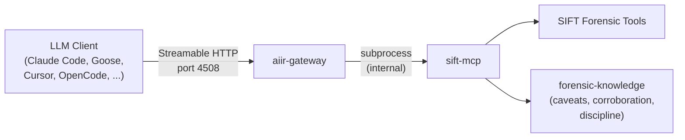
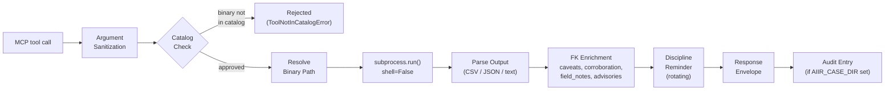
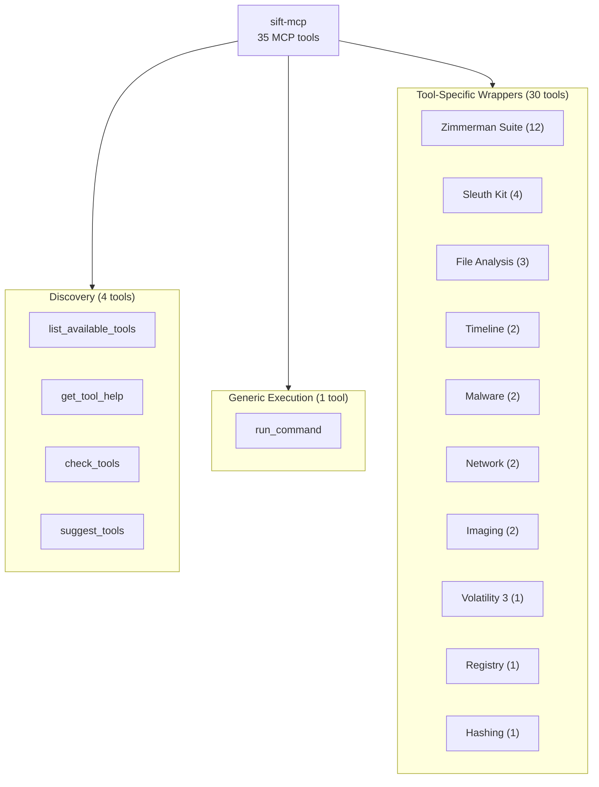

# SIFT MCP Server

An MCP server providing **catalog-gated forensic tool execution with knowledge-enriched response envelopes** for the SIFT workstation. Part of the [AIIR](https://github.com/AppliedIR/aiir) platform.

---

## Overview

sift-mcp runs on a SIFT (Linux) workstation and wraps forensic tool execution with three layers of safety and context:

1. **Catalog gating** -- only binaries defined in YAML catalog files can execute. All execution uses `subprocess.run(shell=False)`. No arbitrary commands.
2. **Knowledge enrichment** -- every response envelope includes artifact caveats, corroboration suggestions, field notes, and discipline reminders sourced from the [forensic-knowledge](https://github.com/AppliedIR/forensic-knowledge) package.
3. **Audit trail** -- when `AIIR_CASE_DIR` is set, every tool execution is logged to `examiners/{slug}/audit/sift-mcp.jsonl`.

> sift-mcp runs as a subprocess of [aiir-gateway](https://github.com/AppliedIR/aiir-gateway). LLM clients connect to the gateway over Streamable HTTP on port 4508, and the gateway proxies tool calls to sift-mcp internally.

**35 MCP tools. 36 catalog entries across 8 YAML files. 83 tests.**

## Architecture

### Connection

LLM clients never connect to sift-mcp directly. The gateway manages it as an internal subprocess.



### Execution Pipeline

Every tool call -- whether through `run_command` or a dedicated wrapper -- follows the same pipeline.



### Tool Categories



## Quick Start

### Installation

sift-mcp is installed on the SIFT workstation alongside the other AIIR components. The recommended approach uses the AIIR installer:

```bash
aiir setup install     # installs all AIIR components on SIFT
aiir setup test        # verifies sift-mcp and other MCPs are working
```

For manual installation:

```bash
git clone https://github.com/AppliedIR/sift-mcp.git
cd sift-mcp
python3 -m venv .venv && source .venv/bin/activate
pip install -e ".[dev]"
```

[forensic-knowledge](https://github.com/AppliedIR/forensic-knowledge) is installed automatically as a pip dependency.

### Client Configuration

LLM clients connect to the gateway, not to sift-mcp directly. Configure your client to use Streamable HTTP:

```bash
aiir setup client      # generates config for your LLM client
```

Or add manually to your client's MCP configuration:

```json
{
  "mcpServers": {
    "aiir": {
      "type": "streamable-http",
      "url": "http://localhost:4508/mcp"
    }
  }
}
```

The gateway exposes all registered MCPs (sift-mcp, forensic-mcp, forensic-rag-mcp, windows-triage-mcp, opencti-mcp) through this single endpoint.

### Verify Installation

```bash
python -c "from sift_mcp.server import create_server; s = create_server(); print(f'{s.name}: ready')"
```

## MCP Tools

### Discovery (4 tools)

| Tool | Description |
|------|-------------|
| `list_available_tools` | List all cataloged tools with installation status. Optional `category` filter. |
| `get_tool_help` | Get usage info, flags, caveats, and FK knowledge for a specific tool. |
| `check_tools` | Check which tools are installed and available. Accepts optional tool name list. |
| `suggest_tools` | Given an artifact type, suggest relevant tools using FK knowledge. Includes corroboration guidance. |

### Generic Execution (1 tool)

| Tool | Description |
|------|-------------|
| `run_command` | Execute any cataloged tool. Takes a command list, purpose string, optional timeout, and optional save_output flag. Rejects binaries not in the catalog. Arguments are sanitized against dangerous flags and shell metacharacters. |

### Zimmerman Suite (12 wrappers)

Each wrapper handles CSV output directory setup, parses output CSVs into structured data, and returns an FK-enriched envelope.

| Tool | Artifact | What It Proves |
|------|----------|----------------|
| `run_amcacheparser` | Amcache.hve | File PRESENCE (not execution) |
| `run_pecmd` | Prefetch (.pf) | EXECUTION with timestamps and run count |
| `run_appcompatcacheparser` | ShimCache (SYSTEM hive) | File PRESENCE (not execution on Win10+) |
| `run_recmd` | Registry hives | Registry values via batch file extraction |
| `run_mftecmd` | $MFT, $UsnJrnl | File system metadata and change journal |
| `run_evtxecmd` | .evtx files | Windows Event Log entries |
| `run_jlecmd` | Jump Lists | User file access per application |
| `run_lecmd` | LNK shortcuts | File access evidence with timestamps |
| `run_sbecmd` | ShellBags | Folder access evidence |
| `run_rbcmd` | Recycle Bin $I files | Deleted file evidence |
| `run_srumecmd` | SRUM database | Application execution and network usage |
| `run_sqlecmd` | SQLite databases | Browser history and other SQLite stores |

### Sleuth Kit (4 wrappers)

| Tool | Description |
|------|-------------|
| `run_fls` | List files and directories in a disk image. Supports deleted file recovery. |
| `run_icat` | Extract a file by inode number from a disk image. |
| `run_blkls` | Extract unallocated clusters for carving. |
| `run_mmls` | Display partition table layout of a disk image. |

### File Analysis (3 wrappers)

| Tool | Description |
|------|-------------|
| `run_exiftool` | Extract metadata from files. Returns parsed JSON. |
| `extract_archive` | Extract or list contents of archives (7z, zip, gz, tar, rar). Supports passwords. |
| `run_bulk_extractor` | Carve forensic records (emails, URLs, EXIF, network packets) from disk images. |

### Timeline (2 wrappers)

| Tool | Description |
|------|-------------|
| `run_hayabusa` | Sigma-based Windows event log analyzer. Auto-installs if missing. |
| `run_mactime` | Convert bodyfile to timeline (Sleuth Kit mactime). |

### Other Wrappers

| Tool | Category | Description |
|------|----------|-------------|
| `run_volatility` | Memory | Run any Volatility 3 plugin against a memory image. JSON or text output. |
| `run_yara` | Malware | Run YARA rules against a target file or directory. |
| `run_strings` | Malware | Extract strings from a file (ASCII, UTF-16LE, UTF-16BE). |
| `run_tshark` | Network | Analyze PCAP with tshark. Display filters and field extraction. |
| `run_zeek` | Network | Analyze PCAP with Zeek. Generates protocol logs (conn, dns, http, ssl). |
| `run_regripper` | Registry | Run RegRipper against a registry hive. Plugin or full analysis. |
| `run_hashdeep` | Hashing | Hash files with hashdeep (MD5, SHA-1, SHA-256). Recursive by default. |
| `run_dc3dd` | Imaging | Create forensic disk image with inline hashing. Blocks writes to raw devices. |
| `run_ewfacquire` | Imaging | Create E01 forensic image with ewfacquire. |

## Response Envelope

Every tool response is wrapped in a structured envelope. The FK enrichment fields are populated from the [forensic-knowledge](https://github.com/AppliedIR/forensic-knowledge) package based on the tool and the artifacts it parses.

```json
{
  "success": true,
  "tool": "run_amcacheparser",
  "data": {"AmcacheParser_Output": {"rows": [...], "total_rows": 42, "columns": [...]}},
  "output_format": "parsed_csv",
  "evidence_id": "sift-steve-20260220-001",
  "examiner": "steve",
  "caveats": [
    "Amcache entries indicate file presence, not execution"
  ],
  "advisories": [
    "This artifact does NOT prove: Program was executed by the user",
    "Amcache proves installation → Prefetch is needed to confirm execution"
  ],
  "corroboration": {
    "for_execution": ["Prefetch", "UserAssist"],
    "for_timeline": ["$MFT timestamps", "USN Journal"]
  },
  "field_notes": {
    "FileKeyLastWriteTimestamp": "When the Amcache entry was last modified"
  },
  "discipline_reminder": "Evidence is sovereign — if results conflict with your hypothesis, revise the hypothesis, never reinterpret evidence to fit",
  "metadata": {
    "elapsed_seconds": 2.31,
    "exit_code": 0,
    "command": ["AmcacheParser", "-f", "Amcache.hve", "--csv", "/tmp/out"]
  }
}
```

| Field | Source | Description |
|-------|--------|-------------|
| `evidence_id` | Audit | Unique ID (`sift-{examiner}-YYYYMMDD-NNN`) for referencing in findings |
| `examiner` | Environment | Resolved from `AIIR_EXAMINER` > `AIIR_ANALYST` > OS username |
| `caveats` | FK tool YAML | Tool-specific limitations |
| `advisories` | FK artifact YAML | What the artifact does NOT prove, common misinterpretations |
| `corroboration` | FK artifact YAML | Suggested cross-references grouped by purpose |
| `field_notes` | FK artifact YAML | Timestamp field meanings and interpretation guidance |
| `discipline_reminder` | Rotating list | One of 10 forensic methodology reminders, cycling deterministically |

## Tool Catalog

The catalog is the security boundary. Only binaries listed in the YAML catalog files under `data/catalog/` can be executed. Each entry specifies the binary name, input style, output format, timeout, and optional FK tool name for knowledge lookup.

**8 catalog files, 36 entries:**

| File | Category | Tool Count | Tools |
|------|----------|------------|-------|
| `zimmerman.yaml` | zimmerman | 13 | AmcacheParser, PECmd, AppCompatCacheParser, RECmd, MFTECmd, EvtxECmd, JLECmd, LECmd, SBECmd, RBCmd, SrumECmd, SQLECmd, bstrings |
| `volatility.yaml` | volatility | 1 | vol3 (Volatility 3 framework -- plugins are arguments, not separate binaries) |
| `timeline.yaml` | timeline | 4 | hayabusa, log2timeline, mactime, psort |
| `sleuthkit.yaml` | sleuthkit | 4 | fls, icat, mmls, blkls |
| `malware.yaml` | malware | 2 | yara, strings |
| `network.yaml` | network | 2 | tshark, zeek |
| `file_analysis.yaml` | file_analysis | 1 | bulk_extractor |
| `misc.yaml` | misc | 9 | exiftool, regripper, hashdeep, 7z, dc3dd, ewfacquire, ewfmount, vshadowinfo, vshadowmount |

Example catalog entry:

```yaml
# data/catalog/zimmerman.yaml
tools:
  - name: AmcacheParser
    binary: AmcacheParser
    input_style: flag
    input_flag: "-f"
    output_format: csv
    timeout_seconds: 600
    description: "Parse Amcache.hve registry hive"
    fk_tool_name: AmcacheParser
    common_flags:
      - flag: "--csv"
        description: "Output directory for CSV"
        required: true
```

## Security

**Catalog gating.** The `run_command` tool and all wrappers validate the binary name against the catalog before execution. Uncataloged binaries are rejected with a `ToolNotInCatalogError`. Binary paths are resolved via `find_binary()` to prevent absolute path bypass.

**Argument sanitization.** All extra arguments are checked against a blocklist of dangerous flags (`-e`, `--exec`, `-enc`, etc.) and shell metacharacters (`;`, `&&`, `||`, backticks, `$(`, `${`). Per-tool overrides allow flags that are dangerous globally but safe for specific tools (e.g., `-e` for bulk_extractor scanner selection).

**No shell.** All execution uses `subprocess.run(shell=False)`.

**Device write blocking.** The imaging tools block writes to raw block device paths (`/dev/sd*`, `/dev/nvme*`, etc.) as a safety measure.

**System directory blocking.** Output file saves are blocked from writing to system directories (`/etc`, `/usr`, `/bin`, etc.).

## Configuration

| Variable | Default | Description |
|----------|---------|-------------|
| `SIFT_TIMEOUT` | `600` | Default command timeout in seconds |
| `SIFT_TOOL_PATHS` | (none) | Colon-separated extra binary search paths (prepended to defaults) |
| `SIFT_HAYABUSA_DIR` | `/opt/hayabusa` | Hayabusa install location |
| `SIFT_CATALOG_DIR` | (none) | Override catalog directory path |
| `AIIR_CASE_DIR` | (none) | Active case directory -- enables audit trail |
| `AIIR_EXAMINER` | (none) | Examiner identity for evidence IDs and audit entries |
| `AIIR_ANALYST` | (none) | Deprecated fallback for `AIIR_EXAMINER` |

Default binary search paths: `/usr/local/bin`, `/usr/bin`, `/opt/zimmerman`, `/opt/volatility3`.

## Case Audit Trail

When `AIIR_CASE_DIR` is set, every tool execution is logged to `examiners/{examiner}/audit/sift-mcp.jsonl`:

```json
{
  "ts": "2026-02-20T14:30:00Z",
  "mcp": "sift-mcp",
  "tool": "run_command",
  "evidence_id": "sift-steve-20260220-001",
  "examiner": "steve",
  "case_id": "case-2026-001",
  "source": "mcp_server",
  "params": {"command": ["AmcacheParser", "-f", "Amcache.hve", "--csv", "/tmp/out"], "purpose": "Parse Amcache for execution evidence"},
  "result_summary": {"exit_code": 0},
  "elapsed_ms": 2310.5
}
```

Evidence IDs resume from the highest sequence number found in the existing audit file on each new server start, preventing ID collisions across sessions.

When `AIIR_CASE_DIR` is not set, audit logging is silently skipped.

## Project Structure

```
sift-mcp/
├── src/sift_mcp/
│   ├── __init__.py
│   ├── __main__.py             # Entry point (python -m sift_mcp)
│   ├── server.py               # FastMCP server, registers all 35 tools
│   ├── catalog.py              # YAML catalog loading, validation, lookup
│   ├── executor.py             # subprocess.run(shell=False) with timeout and save
│   ├── response.py             # FK-enriched response envelope builder
│   ├── config.py               # Environment-based configuration
│   ├── environment.py          # SIFT version detection, binary lookup
│   ├── security.py             # Argument sanitization, catalog verification
│   ├── audit.py                # Per-examiner JSONL audit writer
│   ├── exceptions.py           # SiftError, ToolNotFoundError, ToolNotInCatalogError, etc.
│   ├── installer.py            # Hayabusa auto-installer
│   ├── parsers/
│   │   ├── csv_parser.py       # CSV to structured dicts (Zimmerman output)
│   │   ├── json_parser.py      # JSON and JSONL parsing with truncation
│   │   └── text_parser.py      # Text line parsing with truncation
│   └── tools/
│       ├── discovery.py        # list_available_tools, get_tool_help, check_tools, suggest_tools
│       ├── generic.py          # run_command (catalog-gated generic execution)
│       ├── zimmerman.py        # 12 Zimmerman suite wrappers
│       ├── volatility.py       # run_volatility (all plugins via argument)
│       ├── timeline.py         # run_hayabusa, run_mactime
│       ├── sleuthkit.py        # run_fls, run_icat, run_blkls, run_mmls
│       ├── malware.py          # run_yara, run_strings
│       ├── network.py          # run_tshark, run_zeek
│       ├── file_analysis.py    # run_exiftool, extract_archive, run_bulk_extractor
│       ├── registry.py         # run_regripper
│       ├── hashing.py          # run_hashdeep
│       └── imaging.py          # run_dc3dd, run_ewfacquire
├── data/catalog/               # 8 YAML catalog files (36 tool entries)
├── tests/                      # 83 tests across 10 files
├── pyproject.toml
└── README.md
```

## Development

```bash
pip install -e ".[dev]"

# Run tests
pytest tests/ -v

# Run with coverage
pytest tests/ --cov=sift_mcp --cov-report=term-missing
```

## Responsible Use

This tool is designed to assist trained forensic examiners, not replace them. Tool execution results require the same verification as any other forensic tool output.

**Core principles:**

- **Human authority is final.** Every finding and conclusion must be reviewed and approved by a qualified examiner before it becomes part of the case record.
- **Evidence before claims.** All conclusions must reference actual evidence. Unsupported claims are structurally rejected by the platform.
- **The examiner owns the work product.** AI assistance does not reduce the examiner's responsibility for accuracy, completeness, or defensibility of conclusions.
- **AI output requires the same scrutiny as any other tool.** Treat AI-proposed findings the same way you would treat output from any forensic tool: verify, corroborate, and document.
- **Absence of evidence is not evidence of absence.** The platform guards against premature exclusion and confirmation bias, but the human examiner is the last line of defense.

## Acknowledgments

Architecture and direction by Steve Anson. Implementation by Claude Code (Anthropic).

## License

MIT License. See [LICENSE](LICENSE) for details.
