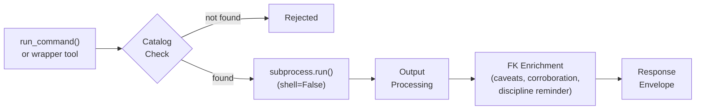
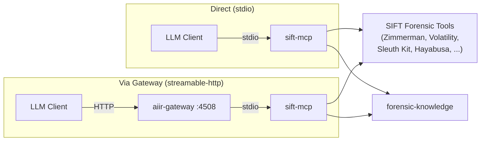
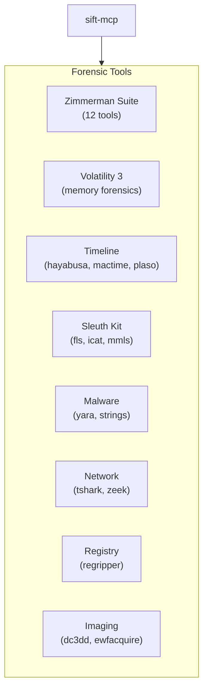

# SIFT MCP Server

A Model Context Protocol (MCP) server providing **forensic tool execution with proactive artifact knowledge** for Claude Code and other MCP-compatible AI assistants. Designed for the SIFT workstation.

## Installation Options

### Option A: As Part of AIR (Recommended)

This MCP is designed as a component of the AIR (Applied Incident Response) platform.

```bash
git clone https://github.com/AppliedIR/sift-mcp.git
cd sift-mcp
python3 -m venv .venv && source .venv/bin/activate
pip install -e ".[dev]"
```

Requires [forensic-knowledge](https://github.com/AppliedIR/forensic-knowledge) (installed automatically as a dependency).

### Option B: Standalone Installation

Use standalone when you need forensic tool execution without the full AIR platform.

See the **Quick Start** section below.

---

## Overview

This server wraps forensic tool execution with catalog-based gating, audit trails, and knowledge-enriched response envelopes. Every tool response includes artifact-specific caveats, corroboration suggestions, and rotating discipline reminders drawn from the forensic-knowledge package.

> **Important:** All commands are executed via `subprocess.run(shell=False)` through a catalog-gated executor. Only tools defined in the catalog can be executed. The catalog defines allowed binaries, argument patterns, and expected output formats.

**Key Capabilities:**

- **Catalog-Gated Execution** - Only tools defined in YAML catalog files can run; no arbitrary command execution
- **Knowledge-Enriched Responses** - Every result includes artifact caveats, false positive context, corroboration suggestions, and field notes from forensic-knowledge
- **Discipline Reminders** - Rotating forensic methodology reminders appended to responses
- **Tool Discovery** - List available tools, check installation status, get contextual help
- **Output Management** - Automatic truncation, SHA-256 hashing, optional save-to-file
- **Audit Trail** - Per-case JSONL audit when `AIIR_CASE_DIR` is set

## MCP Tools

### Discovery (4 tools)

| Tool | Description |
|------|-------------|
| `list_available_tools` | List all cataloged tools with installation status |
| `get_tool_help` | Get tool-specific help, usage examples, and interpretation guidance |
| `check_tools` | Verify which tools are installed and available on this system |
| `suggest_tools` | Given an investigation goal, suggest relevant tools and artifact sources |

### Generic Execution (1 tool)

| Tool | Description |
|------|-------------|
| `run_command` | Execute any cataloged tool with arguments. Catalog-gated: rejects commands not in the catalog. |

### Tool-Specific Wrappers

Convenience wrappers that handle tool-specific argument formatting and output parsing:

| Category | Tools Covered |
|----------|--------------|
| **Zimmerman Suite** | AmcacheParser, AppCompatCacheParser, EvtxECmd, JLECmd, LECmd, MFTECmd, PECmd, RBCmd, RECmd, SBECmd, SrumECmd, SQLECmd |
| **Volatility 3** | pslist, pstree, netscan, malfind, handles, dlllist, cmdline, filescan, hivelist, hashdump, and more |
| **Timeline** | hayabusa, mactime, plaso (log2timeline) |
| **Sleuth Kit** | fls, icat, mmls |
| **Malware Analysis** | yara, strings |
| **Network** | tshark, zeek |
| **Registry** | regripper |
| **File Analysis** | exiftool |
| **Hashing** | hashdeep |
| **Imaging** | dc3dd, ewfacquire |

## Response Envelope

Every successful tool response is wrapped in a structured envelope:

```json
{
  "tool": "AmcacheParser",
  "command": "AmcacheParser.exe -f Amcache.hve --csv /tmp/output",
  "exit_code": 0,
  "output": "...",
  "output_truncated": false,
  "evidence_id": "sift-steve-20260220-001",
  "artifact_caveats": [
    "Amcache entries indicate installation, not necessarily execution",
    "Timestamps reflect installation time, not last run"
  ],
  "corroboration": [
    "Cross-reference with Prefetch for execution confirmation",
    "Check ShimCache for additional execution evidence"
  ],
  "field_notes": "Look for entries without corresponding Prefetch records",
  "discipline_reminder": "Evidence is sovereign — if results conflict with your hypothesis, revise the hypothesis"
}
```

| Field | Description |
|-------|-------------|
| `evidence_id` | Unique identifier (`sift-{examiner}-YYYYMMDD-NNN`) for referencing in case findings |
| `artifact_caveats` | Artifact-specific limitations from forensic-knowledge |
| `corroboration` | Suggested cross-references from forensic-knowledge |
| `field_notes` | Contextual interpretation guidance |
| `discipline_reminder` | Rotating forensic methodology reminder |

## Tool Catalog

Tools are defined in YAML catalog files under `data/catalog/`:

```yaml
# data/catalog/zimmerman.yaml
tools:
  - name: "AmcacheParser"
    binary: "AmcacheParser.exe"
    description: "Parse Amcache.hve for application execution history"
    category: "zimmerman"
    output_format: "csv"
```

The catalog serves as a security boundary — `run_command` validates that the requested binary exists in the catalog before execution. Binaries not in the catalog are rejected.

**Catalog files:** `zimmerman.yaml`, `volatility.yaml`, `timeline.yaml`, `sleuthkit.yaml`, `network.yaml`, `malware.yaml`, `misc.yaml`

## Configuration

| Variable | Default | Description |
|----------|---------|-------------|
| `SIFT_DEFAULT_TIMEOUT` | `300` | Default command timeout in seconds |
| `SIFT_MAX_OUTPUT_BYTES` | `1048576` | Maximum output size before truncation (1MB) |
| `AIIR_CASE_DIR` | (none) | Active case directory for audit trail |
| `AIIR_EXAMINER` | (none) | Examiner identity for audit entries |
| `AIIR_ANALYST` | (none) | Deprecated alias for `AIIR_EXAMINER` |

## Quick Start

```bash
git clone https://github.com/AppliedIR/sift-mcp.git
cd sift-mcp
python3 -m venv .venv && source .venv/bin/activate
pip install -e .
```

**MCP Configuration** (add to `.mcp.json`):

```json
{
  "mcpServers": {
    "sift-mcp": {
      "command": "/path/to/sift-mcp/.venv/bin/python",
      "args": ["-m", "sift_mcp"]
    }
  }
}
```

**Verify installation:**

```bash
python -c "from sift_mcp.server import create_server; s = create_server(); print(f'{s.name}: ready')"
```

## Case Audit Trail

When `AIIR_CASE_DIR` is set, every tool execution is logged to `examiners/{examiner}/audit/sift-mcp.jsonl`:

```json
{"ts": "2026-02-20T14:30:00Z", "tool": "run_command", "evidence_id": "sift-steve-20260220-001", "arguments": {"tool_name": "AmcacheParser", "args": ["-f", "Amcache.hve"]}, "examiner": "steve", "os_user": "user"}
```

## Project Structure

```
sift-mcp/
├── src/sift_mcp/
│   ├── __init__.py
│   ├── __main__.py             # Entry point
│   ├── server.py               # FastMCP server registration
│   ├── catalog.py              # Tool catalog loading and validation
│   ├── executor.py             # Subprocess execution (shell=False)
│   ├── response.py             # FK-enriched response envelope builder
│   ├── config.py               # Configuration management
│   ├── environment.py          # SIFT/WSL environment detection
│   ├── audit.py                # Per-case JSONL audit writer
│   ├── exceptions.py           # Custom exception hierarchy
│   ├── installer.py            # Tool installation helpers
│   ├── parsers/                # Output parsers
│   │   ├── csv_parser.py
│   │   ├── json_parser.py
│   │   └── text_parser.py
│   └── tools/                  # Tool-specific wrappers
│       ├── discovery.py        # list_available_tools, get_tool_help, check_tools, suggest_tools
│       ├── generic.py          # run_command (catalog-gated)
│       ├── zimmerman.py        # Zimmerman suite wrappers
│       ├── volatility.py       # Volatility 3 wrappers
│       ├── timeline.py         # hayabusa, mactime, plaso
│       ├── sleuthkit.py        # fls, icat, mmls
│       ├── malware.py          # yara, strings
│       ├── network.py          # tshark, zeek
│       ├── registry.py         # regripper
│       ├── file_analysis.py    # exiftool
│       ├── hashing.py          # hashdeep
│       └── imaging.py          # dc3dd, ewfacquire
├── data/catalog/               # Tool catalog YAML files
├── tests/                      # 83 tests across 10 files
├── pyproject.toml
└── README.md
```

## Development

```bash
# Run tests
.venv/bin/pytest tests/ -v

# Run with coverage
.venv/bin/pytest tests/ --cov=sift_mcp --cov-report=term-missing
```

## Architecture

### Execution Pipeline

Every tool execution flows through the same pipeline: catalog validation, subprocess execution, output processing, and forensic-knowledge enrichment.



### Connection Modes



### Tool Categories



## Responsible Use

This tool is designed to assist trained forensic analysts, not replace them. Tool execution results require the same verification as any other forensic tool output.

**Core principles:**

- **Human authority is final.** Every finding and conclusion must be reviewed and approved by a qualified analyst before it becomes part of the case record.
- **Evidence before claims.** All conclusions must reference actual evidence. Unsupported claims are structurally rejected by the platform.
- **The analyst owns the work product.** AI assistance does not reduce the analyst's responsibility for accuracy, completeness, or defensibility of conclusions.
- **AI output requires the same scrutiny as any other tool.** Treat AI-proposed findings the same way you would treat output from any forensic tool: verify, corroborate, and document.
- **Absence of evidence is not evidence of absence.** The platform guards against premature exclusion and confirmation bias, but the human analyst is the last line of defense.

## Acknowledgments

Architecture and direction by Steve Anson. Implementation by Claude Code (Anthropic).

## License

MIT License. See [LICENSE](LICENSE) for details.
