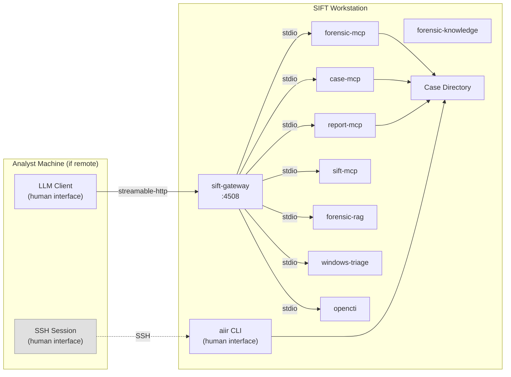
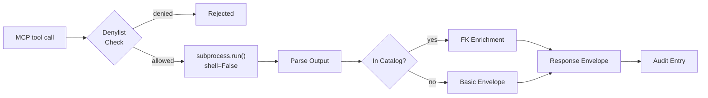

# SIFT MCP
[](https://github.com/AppliedIR/sift-mcp/actions/workflows/ci.yml)
[](https://github.com/AppliedIR/sift-mcp/blob/main/LICENSE)

Monorepo for all SIFT-side AIIR components. 10 packages: forensic-mcp (12 tools + 14 resources), case-mcp (13 tools), report-mcp (6 tools), sift-mcp (6 tools), sift-gateway, forensic-knowledge, forensic-rag, windows-triage, opencti, and sift-common. Part of the [AIIR](https://github.com/AppliedIR/aiir) platform.

**[Documentation](https://appliedir.github.io/aiir/)** ·
[Getting Started](https://appliedir.github.io/aiir/getting-started/) ·
[CLI Reference](https://appliedir.github.io/aiir/cli-reference/) ·
[MCP Reference](https://appliedir.github.io/aiir/mcp-reference/)

## AIIR Lite — Get Started in Minutes

In its simplest form, AIIR Lite provides Claude Code with forensic knowledge and instructions on how to enforce forensic rigor, present findings for human review, and audit actions taken. MCP servers enhance accuracy by providing authoritative information — a forensic knowledge RAG and a Windows triage database — plus optional OpenCTI threat intelligence and REMnux malware analysis.

```
git clone https://github.com/AppliedIR/sift-mcp.git && cd sift-mcp
./quickstart-lite.sh
```

The installer downloads triage databases (~1.1 GB compressed) and builds
a RAG index over 22,000+ forensic knowledge records. This one-time setup
takes approximately 15-30 minutes depending on internet speed and CPU.
Subsequent runs reuse existing databases and index.

```bash
claude
/welcome
```

### What You Get

- **Forensic discipline** — CLAUDE.md + FORENSIC_DISCIPLINE.md + reference docs
- **Prompt reinforcement** — forensic rules injected on every prompt
- **Audit trail** — JSONL logs with SHA-256 hashes for every Bash command and MCP query
- **RAG search** — 23K+ forensic records (Sigma, MITRE ATT&CK, LOLBAS, Atomic Red Team, and more)
- **Windows baseline validation** — offline file/process validation against known_good.db
- **Case management** — `/case init`, `/case open`, `/case status`, `/case list`, `/case close`
- **Post-install verification** — `/welcome` validates setup and orients you
- **Optional add-ons** — OpenCTI, REMnux, Microsoft Learn, Zeltser IR Writing

No gateway, no sandbox, no deny rules. Claude runs forensic tools directly via Bash. Forensic discipline is suggested and reinforced via prompt hooks and reference documents, but Claude Code can choose to ignore them.

### Optional Add-ons

```bash
./quickstart-lite.sh --opencti              # Live threat intelligence
./quickstart-lite.sh --remnux=HOST:PORT     # Automated malware analysis
./quickstart-lite.sh --mslearn              # Microsoft documentation search
./quickstart-lite.sh --zeltser              # IR writing guidelines
```

## Full AIIR — Structural Enforcement

For use cases where more definitive human-in-the-loop approval is desired, the full AIIR suite can be deployed to ensure accountability and enforce human review of findings through cryptographic signing, PIN-gated approvals, and multiple layered controls.

Full AIIR is **LLM client agnostic** — connect any MCP-compatible client through the gateway. Supported clients include Claude Code, Claude Desktop, Cursor, LibreChat, ChatGPT, and any client that can speak to a local MCP. Forensic discipline is provided structurally at the gateway and MCP layer, not through client-specific prompt engineering, so the same rigor applies regardless of which AI model or client drives the investigation.

### What Full AIIR Adds

- LLM client agnostic (Claude Code, Desktop, Cursor, LibreChat, ChatGPT, any MCP client)
- Gateway with auth + lifecycle management (64 tools across 7 backends)
- Structured JSON case files with integrity verification
- Formal report generation (6 profiles)

When Claude Code is the client, additional controls are deployed:

- Bubblewrap sandbox — kernel-level filesystem isolation, Bash restricted to project directory
- 21 permission deny rules — Edit/Write blocked on case data files (findings.json, timeline.json, approvals.jsonl, etc.)
- PreToolUse guard hook — blocks Bash redirections (>, >>, tee) to protected case files
- HMAC-signed findings — PIN-gated approval with PBKDF2-derived cryptographic signing
- Provenance enforcement — rejects findings that lack an evidence trail in the audit log
- PostToolUse audit hook — every Bash command logged to JSONL with SHA-256 hashes
- Prompt hook — forensic discipline reminders injected on every prompt

### Quick Start (Full)

Requires Python 3.11+ and sudo access.

```bash
# One-command quickstart
curl -fsSL https://raw.githubusercontent.com/AppliedIR/sift-mcp/main/quickstart.sh -o /tmp/aiir-quickstart.sh && bash /tmp/aiir-quickstart.sh
```

Or step by step:

```bash
git clone https://github.com/AppliedIR/sift-mcp.git && cd sift-mcp
./setup-sift.sh
```

The installer handles everything: MCP servers, gateway, aiir CLI, HMAC verification ledger (`/var/lib/aiir/verification/`, requires sudo), examiner identity, and LLM client configuration. When you select Claude Code, additional forensic controls are deployed (kernel-level sandbox, case data deny rules, PreToolUse guard hook, PostToolUse audit hook, provenance enforcement, PIN-gated human approval with HMAC signing). Non-shell clients (Claude Desktop, Cursor, etc.) get MCP config only.

For tier selection (quick, recommended, custom) or remote access with TLS, run `setup-sift.sh` directly.

## Architecture

This is a monorepo containing all SIFT-side AIIR components: forensic-mcp, case-mcp, report-mcp, sift-mcp tools, sift-gateway, forensic-knowledge, forensic-rag, windows-triage, opencti, and sift-common. Each MCP runs as a stdio subprocess of the sift-gateway. The LLM client and aiir CLI are the two human-facing tools. The aiir CLI always runs on the SIFT workstation — it requires direct filesystem access to the case directory. When the LLM client runs on a separate machine, the examiner must have SSH access to SIFT for all CLI operations. The LLM client connects to the gateway over Streamable HTTP. It never talks to MCP backends directly.



In co-located deployments, the LLM client also runs on SIFT and no SSH is needed. In production, the LLM client typically runs on a separate machine and connects to the gateway over the network with TLS and bearer token auth. The examiner must have SSH access to SIFT for CLI operations (approve, review, report, etc.).

The gateway exposes each backend as a separate MCP endpoint. Clients can connect to the aggregate endpoint or to individual backends:

```
http://localhost:4508/mcp              # Aggregate (all tools)
http://localhost:4508/mcp/forensic-mcp
http://localhost:4508/mcp/case-mcp
http://localhost:4508/mcp/report-mcp
http://localhost:4508/mcp/sift-mcp
http://localhost:4508/mcp/windows-triage-mcp
http://localhost:4508/mcp/forensic-rag-mcp
http://localhost:4508/mcp/opencti-mcp
```

When the LLM client runs on a different machine, install with `--remote` to generate TLS certificates and a bearer token. The gateway binds to all interfaces and requires `Authorization: Bearer <token>` on every request.

### Execution Pipeline

Every tool call follows the same pipeline: denylist check, safe execution, output parsing, knowledge enrichment (for cataloged tools), audit logging.



## Upgrading from Lite to Full

Both modes share the same knowledge base, MCPs, and audit format. Upgrading adds the gateway, sandbox, enforcement layer, and structured case management. Note: lite case data (markdown files) does not auto-migrate to full case data (structured JSON). Start fresh or transfer findings manually.

## MCP Tools

6 core tools: 5 discovery + 1 generic execution.

### Discovery

| Tool | Description |
|------|-------------|
| `list_available_tools` | List cataloged tools (enriched) — uncataloged tools can also execute |
| `list_missing_tools` | List tools not installed, with installation guidance and alternatives |
| `get_tool_help` | Usage info, flags, caveats, and FK knowledge for a tool |
| `check_tools` | Check which tools are installed and available |
| `suggest_tools` | Given an artifact type, suggest relevant tools with corroboration guidance |

### Generic Execution

| Tool | Description |
|------|-------------|
| `run_command` | Execute any forensic tool (denied binaries are blocked) |

All 30+ per-tool wrappers (Zimmerman suite, Sleuth Kit, Volatility, etc.) are consolidated into `run_command`. A small denylist blocks system-destructive binaries. Tools listed in the catalog get enriched responses with forensic-knowledge data. Uncataloged tools execute with basic response envelopes.

## What Can You Ask?

```
"Parse the Amcache hive at /cases/evidence/Amcache.hve"

"Run Prefetch analysis on all .pf files in /cases/evidence/prefetch/"

"What tools should I use to investigate lateral movement artifacts?"

"Analyze this memory dump with Volatility -- list processes and network connections"

"Run hayabusa against the evtx logs and show critical/high alerts"

"Extract the $MFT and build a filesystem timeline"

"Check which forensic tools are installed on this workstation"
```

## Response Envelope

Every tool response is wrapped in a structured envelope enriched by forensic-knowledge (in `packages/forensic-knowledge/`). This ensures the LLM always receives artifact caveats, corroboration suggestions, and discipline reminders alongside tool output.

```json
{
  "success": true,
  "tool": "run_command",
  "data": {"output": {"rows": ["..."], "total_rows": 42}},
  "data_provenance": "tool_output_may_contain_untrusted_evidence",
  "evidence_id": "sift-steve-20260220-001",
  "examiner": "steve",
  "caveats": [
    "Amcache entries indicate file presence, not execution"
  ],
  "advisories": [
    "This artifact does NOT prove: Program was executed by the user",
    "Amcache proves installation -- Prefetch is needed to confirm execution"
  ],
  "corroboration": {
    "for_execution": ["Prefetch", "UserAssist"],
    "for_timeline": ["$MFT timestamps", "USN Journal"]
  },
  "discipline_reminder": "Evidence is sovereign -- if results conflict with your hypothesis, revise the hypothesis, never reinterpret evidence to fit"
}
```

| Field | Description |
|-------|-------------|
| `evidence_id` | Unique ID for referencing in findings (`sift-{examiner}-YYYYMMDD-NNN`) |
| `caveats` | Tool-specific limitations from FK |
| `advisories` | What the artifact does NOT prove, common misinterpretations |
| `corroboration` | Suggested cross-references grouped by purpose |
| `field_notes` | Timestamp field meanings and interpretation guidance |
| `discipline_reminder` | Rotating forensic methodology reminder |

## Execution Security

A denylist blocks destructive system commands (mkfs, dd, fdisk, shutdown, etc.). When Claude Code is the LLM client, additional deny rules block Edit/Write to case data files (findings.json, timeline.json, approvals.jsonl, etc.), a PreToolUse hook guards against Bash redirections to protected files, and findings.json and timeline.json are set to chmod 444 after every write. All other binaries can execute. This follows the REMnux MCP philosophy: VM/container isolation is the security boundary, not in-band command filtering.

Additional protections:
- `subprocess.run(shell=False)` — no shell, no arbitrary command chains
- Argument sanitization — shell metacharacters blocked
- Path validation — kernel interfaces (/proc, /sys, /dev) blocked for input
- `rm` protection — case directories protected from deletion
- Output truncation — large output capped
- Audit trail — every execution logged with evidence ID

## Forensic Catalog (Enrichment)

Tools listed in YAML catalog files get enriched responses with forensic-knowledge data (caveats, corroboration suggestions, field meanings, discipline reminders). Uncataloged tools execute with basic response envelopes (evidence_id, audit, discipline reminder).

| File | Tools |
|------|-------|
| `zimmerman.yaml` | AmcacheParser, PECmd, AppCompatCacheParser, RECmd, MFTECmd, EvtxECmd, JLECmd, LECmd, SBECmd, RBCmd, SrumECmd, SQLECmd, bstrings |
| `volatility.yaml` | vol3 |
| `timeline.yaml` | hayabusa, log2timeline, mactime, psort |
| `sleuthkit.yaml` | fls, icat, mmls, blkls |
| `malware.yaml` | yara, strings, ssdeep, binwalk |
| `analysis.yaml` | grep, awk, sed, cut, sort, uniq, wc, head, tail, tr, diff, jq, zcat, zgrep, tar, unzip, file, stat, find, ls, md5sum, sha1sum, sha256sum, xxd, hexdump, readelf, objdump |
| `network.yaml` | tshark, zeek |
| `file_analysis.yaml` | bulk_extractor |
| `misc.yaml` | exiftool, regripper, hashdeep, 7z, dc3dd, ewfacquire, ewfmount, vshadowinfo, vshadowmount |

Some analysis tools have flag restrictions enforced by `security.py`: `find` blocks `-exec`/`-execdir`/`-delete`; `sed` blocks `-i`/`--in-place`; `tar` blocks extraction/creation and code execution flags (listing only); `unzip` blocks overwrite modes; `awk` program text is scanned for `system()`, `getline`, pipe operators, and output redirection.

## Prerequisites

- SIFT Workstation (Ubuntu-based) — for full AIIR
- Any Linux/macOS machine — for AIIR Lite
- Python 3.11+
- sudo access (required for full AIIR's HMAC verification ledger at `/var/lib/aiir/verification/`)
- Forensic tools installed via SIFT package or manually

### External Dependencies

- **Zeltser IR Writing MCP** (https://website-mcp.zeltser.com/mcp) — Required for report generation (full AIIR). The `aiir setup client` wizard configures this automatically. HTTPS, no authentication required.
- **MS Learn MCP** (https://learn.microsoft.com/api/mcp) — Optional. Provides Microsoft documentation search.

## Configuration

| Variable | Default | Description |
|----------|---------|-------------|
| `SIFT_TIMEOUT` | `600` | Default command timeout in seconds |
| `SIFT_TOOL_PATHS` | (none) | Extra binary search paths (colon-separated) |
| `SIFT_HAYABUSA_DIR` | `/opt/hayabusa` | Hayabusa install location |
| `AIIR_CASE_DIR` | (none) | Active case directory — enables audit trail. Falls back to `~/.aiir/active_case` if unset. |
| `AIIR_CASES_DIR` | (none) | Root directory containing all cases |
| `AIIR_EXAMINER` | (none) | Examiner identity for evidence IDs and audit |

### Remote Access (TLS + Auth)

When installed with `--remote`, `setup-sift.sh` generates a local CA and gateway certificate at `~/.aiir/tls/`. The gateway binds to `0.0.0.0:4508` with TLS enabled. A bearer token (`aiir_gw_` prefix) is generated and written to `gateway.yaml`.

Remote clients join via platform-specific setup scripts. The installer prints per-OS commands with a join code. See the [Deployment Guide](https://appliedir.github.io/aiir/deployment/) for details.

Without `--remote`, the gateway listens on `127.0.0.1` only. Auth tokens are still generated but optional for localhost.

## Security Considerations

All AIIR components are assumed to run on a private forensic network, protected by firewalls, and not exposed to incoming connections from the Internet or potentially hostile systems. The design assumes dedicated, isolated systems are used throughout.

Any data loaded into the system or its component VMs, computers, or instances runs the risk of being exposed to the underlying AI. Only place data on these systems that you are willing to send to your AI provider.

Outgoing Internet connections are required for report generation (Zeltser IR Writing MCP) and optionally used for threat intelligence (OpenCTI) and documentation (MS Learn MCP). No incoming connections from external systems should be allowed.

AIIR is designed so that AI interactions flow through MCP tools, enabling security controls and audit trails. Clients with direct shell access (like Claude Code) can also operate outside MCP, but `aiir setup client` deploys forensic controls for Claude Code: a kernel-level sandbox restricts Bash writes, deny rules block Edit/Write to case data files, a PreToolUse hook guards against Bash redirections to protected files, a PostToolUse hook captures every Bash command to the audit trail, provenance enforcement ensures findings are traceable to evidence, and an HMAC verification ledger provides cryptographic proof that approved findings haven't been tampered with. AIIR is not designed to defend against a malicious AI or to constrain the AI client that you deploy.

## Audit Trail and Provenance

Every MCP tool call is logged to a per-backend JSONL file in the case `audit/` directory with a unique evidence ID (`{backend}-{examiner}-{date}-{seq}`). When Claude Code is the client, a PostToolUse hook additionally captures every Bash command to `audit/claude-code.jsonl`.

Findings recorded via `record_finding()` are classified by provenance tier based on the audit trail:

| Tier | Source | Meaning |
|------|--------|---------|
| MCP | MCP audit log | Evidence gathered through an MCP tool (system-witnessed) |
| HOOK | Claude Code hook log | Evidence gathered via Bash with hook capture (framework-witnessed) |
| SHELL | `supporting_commands` parameter | Evidence from direct shell commands (self-reported) |
| NONE | No audit record | No evidence trail — finding is rejected by hard gate |

Findings with NONE provenance and no supporting commands are rejected. This ensures every finding is traceable to evidence.

Content integrity is protected by SHA-256 hashes computed at staging and verified at approval. Cross-file verification compares hashes stored in `findings.json` against those in `approvals.jsonl` to detect post-approval tampering.

## Report Generation

Report generation uses the report-mcp package (6 tools) with data-driven profiles:

| Profile | Purpose |
|---------|---------|
| `full` | Comprehensive IR report with all approved data |
| `executive` | Management briefing (1-2 pages, non-technical) |
| `timeline` | Chronological event narrative |
| `ioc` | Structured IOC export with MITRE mapping |
| `findings` | Detailed approved findings |
| `status` | Quick status for standups |

`generate_report()` produces structured JSON with case data, IOC aggregation, MITRE ATT&CK mapping, and Zeltser IR Writing guidance. The LLM renders narrative sections using Zeltser's IR templates. Reports only include APPROVED findings — provenance, confidence, and other internal working notes are stripped.

## Evidence Handling

Never place original evidence on any AIIR system. Only use working copies for which verified originals or backups exist. AIIR workstations process evidence through AI-connected tools, and any data loaded into these systems may be transmitted to the configured AI provider. Treat all AIIR systems as analysis environments, not evidence storage.

Evidence integrity is verified by SHA-256 hashes recorded at registration. Examiners can optionally lock evidence to read-only via `aiir evidence lock`. Proper evidence integrity depends on verified hashes, write blockers, and chain-of-custody procedures that exist outside this platform.

Case directories can reside on external or removable media. ext4 is preferred for full permission support. NTFS and exFAT are acceptable but file permission controls (read-only protection) will be silently ineffective. FAT32 is discouraged due to the 4 GB file size limit.

## Responsible Use

This project demonstrates the capabilities of AI-assisted incident response. While steps have been taken to enforce human-in-the-loop controls, it is ultimately the responsibility of each examiner to ensure that their findings are accurate and complete. Ultimate responsibility rests with the human. The AI, like a hex editor, is a tool to be used by properly trained incident response professionals. Users are responsible for ensuring their use complies with applicable laws, regulations, and organizational policies.

## Acknowledgments

Architecture and direction by Steve Anson. Implementation by Claude Code (Anthropic). Design inspiration drawn from Lenny Zeltser's [REMnux MCP](https://github.com/REMnux/remnux-mcp-server).

## License

MIT License - see [LICENSE](LICENSE)
