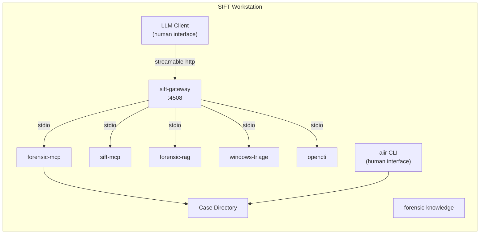
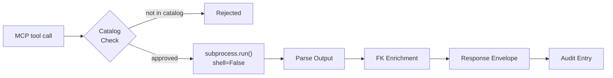

# SIFT MCP

Monorepo for all SIFT-side AIIR components. The sift-mcp package provides 5 core tools for catalog-gated forensic tool execution with knowledge-enriched response envelopes. The monorepo also contains forensic-mcp (15 tools + 14 resources), sift-gateway, forensic-knowledge, forensic-rag, windows-triage, and opencti. Part of the [AIIR](https://github.com/AppliedIR/aiir) platform.

## Architecture

This is a monorepo containing all SIFT-side AIIR components: forensic-mcp, sift-mcp tools, sift-gateway, forensic-knowledge, forensic-rag, windows-triage, and opencti. The sift-mcp tool execution package runs as a subprocess of the sift-gateway. The LLM client and aiir CLI are the two human-facing tools. They always run on the same machine, which can be the SIFT workstation or a separate computer. The LLM client connects to the gateway over Streamable HTTP. It never talks to sift-mcp directly.



### Execution Pipeline

Every tool call follows the same pipeline: catalog check, safe execution, output parsing, knowledge enrichment, audit logging.



## MCP Tools

5 core tools: 4 discovery + 1 generic execution.

### Discovery

| Tool | Description |
|------|-------------|
| `list_available_tools` | List all cataloged tools with installation status |
| `get_tool_help` | Usage info, flags, caveats, and FK knowledge for a tool |
| `check_tools` | Check which tools are installed and available |
| `suggest_tools` | Given an artifact type, suggest relevant tools with corroboration guidance |

### Generic Execution

| Tool | Description |
|------|-------------|
| `run_command` | Execute any cataloged tool with argument sanitization |

All 30+ per-tool wrappers (Zimmerman suite, Sleuth Kit, Volatility, etc.) are consolidated into `run_command`. The tool catalog still defines each binary's input flags, output format, timeout, and FK knowledge mapping. The wrappers existed to auto-build arguments, but `run_command` validates against the same catalog schemas.

## What Can You Ask?

```
"Parse the Amcache hive at /cases/evidence/Amcache.hve"

"Run Prefetch analysis on all .pf files in /cases/evidence/prefetch/"

"What tools should I use to investigate lateral movement artifacts?"

"Analyze this memory dump with Volatility -- list processes and network connections"

"Run hayabusa against the evtx logs and show critical/high alerts"

"Extract the $MFT and build a filesystem timeline"

"Check which forensic tools are installed on this workstation"
```

## Response Envelope

Every tool response is wrapped in a structured envelope enriched by forensic-knowledge (in `packages/forensic-knowledge/`). This ensures the LLM always receives artifact caveats, corroboration suggestions, and discipline reminders alongside tool output.

```json
{
  "success": true,
  "tool": "run_amcacheparser",
  "data": {"AmcacheParser_Output": {"rows": ["..."], "total_rows": 42}},
  "evidence_id": "sift-steve-20260220-001",
  "examiner": "steve",
  "caveats": [
    "Amcache entries indicate file presence, not execution"
  ],
  "advisories": [
    "This artifact does NOT prove: Program was executed by the user",
    "Amcache proves installation -- Prefetch is needed to confirm execution"
  ],
  "corroboration": {
    "for_execution": ["Prefetch", "UserAssist"],
    "for_timeline": ["$MFT timestamps", "USN Journal"]
  },
  "discipline_reminder": "Evidence is sovereign -- if results conflict with your hypothesis, revise the hypothesis, never reinterpret evidence to fit"
}
```

| Field | Description |
|-------|-------------|
| `evidence_id` | Unique ID for referencing in findings (`sift-{examiner}-YYYYMMDD-NNN`) |
| `caveats` | Tool-specific limitations from FK |
| `advisories` | What the artifact does NOT prove, common misinterpretations |
| `corroboration` | Suggested cross-references grouped by purpose |
| `field_notes` | Timestamp field meanings and interpretation guidance |
| `discipline_reminder` | Rotating forensic methodology reminder |

## Tool Catalog

The catalog is the security boundary. Only binaries listed in YAML catalog files can execute. All execution uses `subprocess.run(shell=False)` -- no shell, no arbitrary commands.

| File | Tools |
|------|-------|
| `zimmerman.yaml` | AmcacheParser, PECmd, AppCompatCacheParser, RECmd, MFTECmd, EvtxECmd, JLECmd, LECmd, SBECmd, RBCmd, SrumECmd, SQLECmd, bstrings |
| `volatility.yaml` | vol3 |
| `timeline.yaml` | hayabusa, log2timeline, mactime, psort |
| `sleuthkit.yaml` | fls, icat, mmls, blkls |
| `malware.yaml` | yara, strings |
| `network.yaml` | tshark, zeek |
| `file_analysis.yaml` | bulk_extractor |
| `misc.yaml` | exiftool, regripper, hashdeep, 7z, dc3dd, ewfacquire, ewfmount, vshadowinfo, vshadowmount |

## Prerequisites

- SIFT Workstation (Ubuntu-based)
- Python 3.10+
- Forensic tools installed via SIFT package or manually

## Quick Start

```bash
git clone https://github.com/AppliedIR/sift-mcp.git && cd sift-mcp
./scripts/setup-sift.sh
```

The interactive installer handles all SIFT packages (forensic-mcp, sift-mcp, sift-gateway, forensic-rag, windows-triage, opencti), the aiir CLI, and LLM client configuration.

## Configuration

| Variable | Default | Description |
|----------|---------|-------------|
| `SIFT_TIMEOUT` | `600` | Default command timeout in seconds |
| `SIFT_TOOL_PATHS` | (none) | Extra binary search paths (colon-separated) |
| `SIFT_HAYABUSA_DIR` | `/opt/hayabusa` | Hayabusa install location |
| `AIIR_CASE_DIR` | (none) | Active case directory -- enables audit trail (flat layout, no examiner subdirectory) |
| `AIIR_EXAMINER` | (none) | Examiner identity for evidence IDs and audit |

## Security Considerations

All AIIR components are assumed to run on a private forensic network, protected by firewalls, and not exposed to incoming connections from the Internet or potentially hostile systems. The design assumes dedicated, isolated systems are used throughout.

Any data loaded into the system or its component VMs, computers, or instances runs the risk of being exposed to the underlying AI. Only place data on these systems that you are willing to send to your AI provider.

While outgoing connections to the Internet are used for some optional components (OpenCTI, MS Learn MCP, Zeltser IR Writing MCP), no incoming connections from external systems should be allowed.

## Evidence Handling

Never place original evidence on any AIIR system. Only use working copies for which verified originals or backups exist. AIIR workstations process evidence through AI-connected tools, and any data loaded into these systems may be transmitted to the configured AI provider. Treat all AIIR systems as analysis environments, not evidence storage.

AIIR sets registered evidence files to read-only (chmod 444) as a defense-in-depth measure to prevent accidental modification. This is not an evidence integrity feature. Proper evidence integrity depends on verified hashes, write blockers, and chain-of-custody procedures that exist outside this platform.

Case directories can reside on external or removable media. ext4 is preferred for full permission support. NTFS and exFAT are acceptable but file permission controls (read-only protection) will be silently ineffective. FAT32 is discouraged due to the 4 GB file size limit.

## Responsible Use

This project demonstrates the capabilities of Artificial Intelligence Incident Response (AIIR). While steps have been taken to enforce human-in-the-loop controls, it is ultimately the responsibility of each examiner to ensure that their findings are accurate and complete. Ultimate responsibility rests with the human. The AI, like a hex editor, is a tool to be used by properly trained incident response professionals. Users are responsible for ensuring their use complies with applicable laws, regulations, and organizational policies.

## Acknowledgments

Architecture and direction by Steve Anson. Implementation by Claude Code (Anthropic). Design inspiration drawn from Lenny Zeltser's [REMnux MCP](https://github.com/REMnux/remnux-mcp-server).

## License

MIT License - see [LICENSE](LICENSE)
