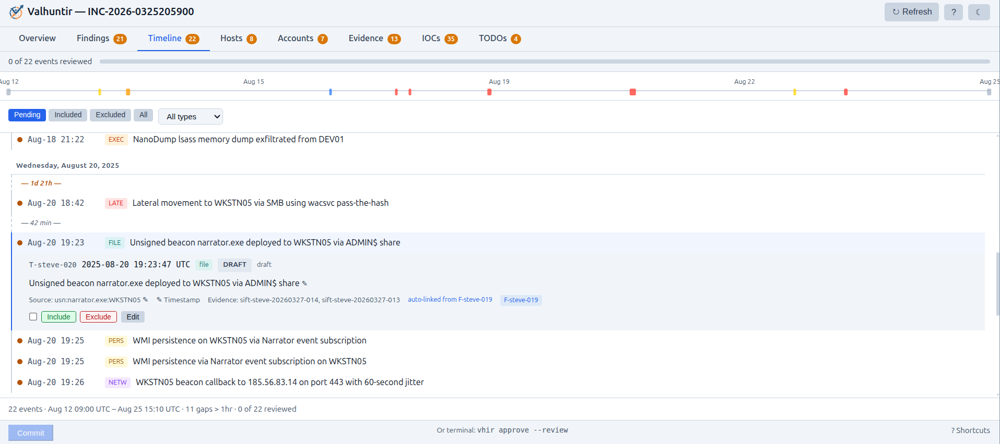
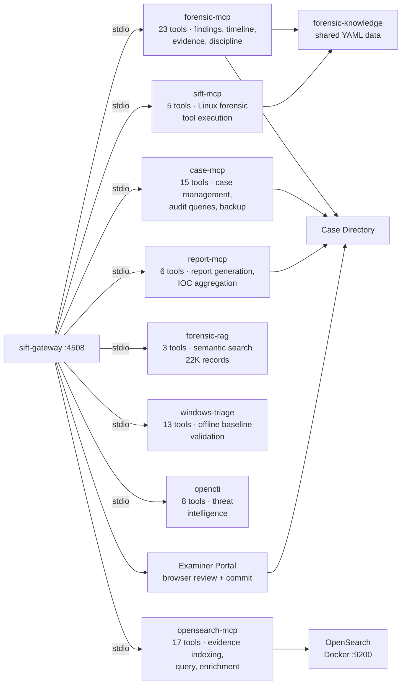
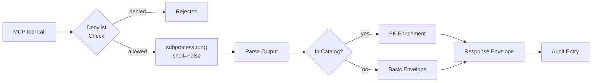

# SIFT MCP
[](https://github.com/AppliedIR/sift-mcp/actions/workflows/ci.yml)
[](https://github.com/AppliedIR/sift-mcp/blob/main/LICENSE)

Monorepo for all SIFT-side Valhuntir components. 11 packages: forensic-mcp (23 tools), case-mcp (15 tools), report-mcp (6 tools), sift-mcp (5 tools), sift-gateway, forensic-knowledge, forensic-rag (3 tools), windows-triage (13 tools), opencti (8 tools), sift-common, and case-dashboard. With optional [opensearch-mcp](https://github.com/AppliedIR/opensearch-mcp) (17 tools) for evidence indexing and querying at scale. Part of the [Valhuntir](https://github.com/AppliedIR/Valhuntir) platform.

**[Documentation](https://appliedir.github.io/Valhuntir/)** ·
[Getting Started](https://appliedir.github.io/Valhuntir/getting-started/) ·
[CLI Reference](https://appliedir.github.io/Valhuntir/cli-reference/) ·
[MCP Reference](https://appliedir.github.io/Valhuntir/mcp-reference/)

> **Important Note** — While extensively tested, this is a new platform.
> ALWAYS verify results and guide the investigative process. If you just
> tell Valhuntir to "Find Evil" it will more than likely hallucinate
> rather than provide meaningful results. The AI can accelerate, but the
> human must guide it and review all decisions.

## Valhuntir — AI-Assisted Forensic Investigation

Valhuntir is a forensic investigation platform that connects AI to structured MCP tools, enforces human-in-the-loop review, and maintains a complete audit trail from evidence to finding to report.

The platform is **LLM client agnostic** — connect any locally installed MCP-compatible client through the gateway. Supported clients include Claude Code, Claude Desktop, Cherry Studio, self-hosted LibreChat, and any client that supports Streamable HTTP transport with Bearer token authentication. The client must run on your machine or local network — cloud-hosted services cannot reach internal gateway addresses. Forensic discipline is provided structurally at the gateway and MCP layer, not through client-specific prompt engineering, so the same rigor applies regardless of which AI model or client drives the investigation.

With [opensearch-mcp](https://github.com/AppliedIR/opensearch-mcp), evidence is parsed programmatically and indexed into OpenSearch, giving the LLM 17 purpose-built query tools instead of consuming billions of tokens reading raw artifacts. A 30-host triage collection with 50 million records becomes instantly searchable. Triage baseline and threat intelligence enrichment run programmatically — zero LLM tokens consumed. OpenSearch integration is optional but recommended for investigations at scale.

> Looking for a simpler setup without the gateway or OpenSearch? See [Valhuntir Lite](#valhuntir-lite).

### What You Get

- **Gateway** with auth + lifecycle management (up to 90 tools across 8 backends)
- **Evidence indexing** — 15 parsers (evtx, EZ tools, Volatility, JSON, CSV, W3C, and more) with deterministic dedup and full provenance (via opensearch-mcp)
- **Structured querying** — case summary, search, aggregation, timeline, field enumeration, detection listing (via opensearch-mcp)
- **Programmatic enrichment** — triage baseline validation and threat intelligence stamping at index scale, zero LLM tokens (via opensearch-mcp)
- **Examiner Portal** — 8-tab browser UI for review, approval, and commit (findings, timeline, hosts, accounts, evidence, IOCs, TODOs, overview) with keyboard shortcuts, search, provenance chain display, and challenge-response authentication
- **IOC auto-extraction** from findings with approval cascade
- **Evidence provenance chain** linking findings back to registered evidence through audited tool executions
- **RAG search** — 22K+ forensic records (Sigma, MITRE ATT&CK, LOLBAS, Atomic Red Team, and more)
- **Windows baseline validation** — offline file/process/service validation against 2.6M known-good records
- **Case management** — init, activate, close, backup with SHA-256 manifest and verification
- **Structured JSON case files** with integrity verification
- **Formal report generation** (6 profiles) with Zeltser IR Writing guidance
- **Audit trail** — JSONL logs with SHA-256 hashes for every MCP tool call and Bash command
- **Optional add-ons** — OpenCTI threat intelligence, REMnux malware analysis, Microsoft Learn, Zeltser IR Writing

When Claude Code is the client, additional controls are deployed:

- Bubblewrap sandbox — kernel-level filesystem isolation, Bash restricted to project directory
- 41 permission deny rules — Edit/Write blocked on case data files (findings.json, timeline.json, approvals.jsonl, etc.)
- PreToolUse guard hook — blocks Bash redirections (>, >>, tee) to protected case files
- HMAC-signed findings — password-gated approval with PBKDF2-derived cryptographic signing
- Provenance enforcement — rejects findings that lack an evidence trail in the audit log
- PostToolUse audit hook — every Bash command logged to JSONL with SHA-256 hashes
- Prompt hook — forensic discipline reminders injected on every prompt

Examiners review findings in the Examiner Portal — validating artifacts, observations, and interpretations, with the full command audit trail from original evidence to final result.


The timeline view places findings and other observables in chronological context across the investigation.



### Investigation Workflow

The recommended workflow uses OpenSearch for evidence indexing, enabling structured queries across millions of records. Without OpenSearch, the same investigation tools are available through direct file-based analysis via `run_command` — OpenSearch adds scale, not capability.

```
1. case_init("Ransomware Investigation")     → Create case, set examiner
2. evidence_register(path, description)       → SHA-256 hash, chain of custody
3. idx_ingest(case_dir, hostname)             → Parse + index into OpenSearch
4. idx_case_summary(case_id)                  → Hosts, artifacts, fields, time range
5. idx_search / idx_aggregate / idx_timeline  → Structured queries (~500 tokens each)
6. idx_enrich_triage + idx_enrich_intel       → Programmatic enrichment (zero tokens)
7. record_finding / record_timeline_event     → Stage as DRAFT with provenance
8. Examiner Portal or vhir approve            → Human review → APPROVED/REJECTED
9. generate_report(profile="full")            → IR report from approved findings
```

Without OpenSearch, steps 3-6 are replaced by direct tool execution (`run_command`) and manual analysis. The investigation workflow, findings, timeline, and reporting are identical either way.

### Architecture

Each MCP backend runs as a stdio subprocess of the sift-gateway, aggregated behind a single HTTP endpoint. opensearch-mcp connects to a local or remote OpenSearch instance for evidence indexing and querying. The Examiner Portal is served by the gateway for browser-based review and approval. See the [Valhuntir README](https://github.com/AppliedIR/Valhuntir#deployment-overview) for the full deployment topology including REMnux and Windows VMs.


```mermaid
graph LR
    GW["sift-gateway :4508"]

    FM["forensic-mcp<br/>23 tools · findings, timeline,<br/>evidence, discipline"]
    CM["case-mcp<br/>15 tools · case management,<br/>audit queries, backup"]
    RM["report-mcp<br/>6 tools · report generation,<br/>IOC aggregation"]
    SM["sift-mcp<br/>5 tools · Linux forensic<br/>tool execution"]
    RAG["forensic-rag<br/>3 tools · semantic search<br/>22K records"]
    WT["windows-triage<br/>13 tools · offline baseline<br/>validation"]
    OC["opencti<br/>8 tools · threat<br/>intelligence"]
    OS["opensearch-mcp<br/>17 tools · evidence indexing,<br/>query, enrichment"]
    CD["Examiner Portal<br/>browser review + commit"]
    FK["forensic-knowledge<br/>shared YAML data"]
    CASE["Case Directory"]
    OSD["OpenSearch<br/>Docker :9200"]

    GW -->|stdio| FM
    GW -->|stdio| CM
    GW -->|stdio| RM
    GW -->|stdio| SM
    GW -->|stdio| RAG
    GW -->|stdio| WT
    GW -->|stdio| OC
    GW -->|stdio| OS
    GW --> CD
    FM --> FK
    SM --> FK
    FM --> CASE
    CM --> CASE
    RM --> CASE
    CD --> CASE
    OS --> OSD
```

The gateway exposes each backend as a separate MCP endpoint. Clients can connect to the aggregate endpoint or to individual backends:

```
http://localhost:4508/mcp              # Aggregate (all tools)
http://localhost:4508/mcp/forensic-mcp
http://localhost:4508/mcp/case-mcp
http://localhost:4508/mcp/report-mcp
http://localhost:4508/mcp/sift-mcp
http://localhost:4508/mcp/windows-triage-mcp
http://localhost:4508/mcp/forensic-rag-mcp
http://localhost:4508/mcp/opencti-mcp
http://localhost:4508/mcp/opensearch-mcp
```

When the LLM client runs on a different machine, install with `--remote` to generate TLS certificates and a bearer token. The gateway binds to all interfaces and requires `Authorization: Bearer <token>` on every request.

### Deployment Configurations

All configurations run on a SIFT Workstation (Ubuntu-based) with Python 3.10+.

| Configuration | What runs on SIFT | RAM (min) | RAM (recommended) | Best for |
|---|---|---|---|---|
| **Valhuntir** | Gateway + 8 backends + OpenSearch (Docker) | 24 GB | 32 GB | Solo analyst, lab environments |
| **Valhuntir (remote OpenSearch)** | Gateway + 8 backends; OpenSearch on separate host | 16 GB SIFT, 8 GB OS host | 16 GB SIFT, 16 GB OS host | Larger cases, persistent clusters |
| **Valhuntir + Windows** | Above + wintools-mcp on Windows VM | +8 GB Windows | +8 GB Windows | Full artifact coverage |
| **Valhuntir + REMnux** | Above + remnux-mcp on REMnux VM | +4 GB REMnux | +8 GB REMnux | Malware analysis |
| **[Valhuntir Lite](#valhuntir-lite)** | No gateway, no OpenSearch — stdio MCPs only | 8 GB | 16 GB | Quick setup, smaller investigations |

**Where the RAM goes (all-in-one Valhuntir):**

- OpenSearch Docker: 4-12 GB heap (default 4 GB, increase for larger cases)
- Gateway + 8 MCP backends: ~2-3 GB (Python processes)
- RAG embedding model: ~2 GB (when forensic-rag is loaded)
- Evidence parsing during ingest: 1-4 GB (spikes during large ingests)
- OS + Docker overhead: ~2 GB

Disk space: ~14 GB for RAG + triage databases, plus evidence and OpenSearch indices.

### Valhuntir Installation

Requires Python 3.10+ and sudo access. The installer handles everything: MCP servers, gateway, vhir CLI, HMAC verification ledger, examiner identity, and LLM client configuration. When you select Claude Code, the forensic controls listed above are deployed automatically.

**Quick** — Core platform only, no databases (~70 MB):

```
curl -fsSL https://raw.githubusercontent.com/AppliedIR/sift-mcp/main/quickstart.sh -o /tmp/vhir-quickstart.sh && bash /tmp/vhir-quickstart.sh
```

**Recommended** — Adds the RAG knowledge base (22,000+ records from 23 authoritative sources) and Windows triage databases (2.6M baseline records). Requires ~14 GB disk space:

- ~7 GB — ML dependencies (PyTorch, CUDA) required by the RAG embedding model
- ~6 GB — Windows triage baseline databases (2.6M rows, decompressed)
- ~1 GB — RAG index, source code, and everything else

```
curl -fsSL https://raw.githubusercontent.com/AppliedIR/sift-mcp/main/quickstart.sh -o /tmp/vhir-quickstart.sh && bash /tmp/vhir-quickstart.sh --recommended
```

**Custom** — Individual package selection, OpenSearch integration, OpenCTI, or remote access with TLS:

```
git clone https://github.com/AppliedIR/sift-mcp.git && cd sift-mcp
./setup-sift.sh
```

**Adding OpenSearch** — Add `--opensearch` to any install command to include evidence indexing. The installer clones the repo, installs the package, and sets up the OpenSearch Docker container automatically. Requires Docker.

```
bash /tmp/vhir-quickstart.sh --recommended --opensearch
```

If opensearch-mcp is already cloned alongside sift-mcp, the installer detects and installs it automatically — no flag needed.

## Valhuntir Lite

In its simplest form, Valhuntir Lite provides Claude Code with forensic knowledge and instructions on how to enforce forensic rigor, present findings for human review, and audit actions taken. MCP servers enhance accuracy by providing authoritative information — a forensic knowledge RAG and a Windows triage database — plus optional OpenCTI threat intelligence and REMnux malware analysis.

**Quick** — Forensic discipline, MCP packages, and config. No databases (<70 MB):

```
git clone https://github.com/AppliedIR/sift-mcp.git
cd sift-mcp
./quickstart-lite.sh --quick
```

**Recommended** — Adds the RAG knowledge base (22,000+ records from 23 authoritative sources) and Windows triage databases (2.6M baseline records). Requires ~14 GB disk space:

- ~7 GB — ML dependencies (PyTorch, CUDA) required by the RAG embedding model
- ~6 GB — Windows triage baseline databases (2.6M rows, decompressed)
- ~1 GB — RAG index, source code, and everything else

```
git clone https://github.com/AppliedIR/sift-mcp.git
cd sift-mcp
./quickstart-lite.sh
```

This one-time setup takes approximately 15-30 minutes depending on
internet speed and CPU. Subsequent runs reuse existing databases and index.

```bash
claude
/welcome
```

### What You Get

- **Forensic discipline** — CLAUDE.md + FORENSIC_DISCIPLINE.md + reference docs
- **Prompt reinforcement** — forensic rules injected on every prompt
- **Audit trail** — JSONL logs with SHA-256 hashes for every Bash command and MCP query
- **RAG search** — 22K+ forensic records (Sigma, MITRE ATT&CK, LOLBAS, Atomic Red Team, and more)
- **Windows baseline validation** — offline file/process validation against known_good.db
- **Case management** — `/case init`, `/case open`, `/case status`, `/case list`, `/case close`
- **Post-install verification** — `/welcome` validates setup and orients you
- **Optional add-ons** — OpenCTI, REMnux, Microsoft Learn, Zeltser IR Writing

No gateway, no sandbox, no deny rules. Claude runs forensic tools directly via Bash. Forensic discipline is suggested and reinforced via prompt hooks and reference documents, but Claude Code can choose to ignore them.

### Optional Add-ons

```bash
./quickstart-lite.sh --opencti              # Live threat intelligence
./quickstart-lite.sh --remnux=HOST:PORT     # Automated malware analysis
./quickstart-lite.sh --mslearn              # Microsoft documentation search
./quickstart-lite.sh --zeltser              # IR writing guidelines
```

## Upgrading from Lite to Valhuntir

Both modes share the same knowledge base, MCPs, and audit format. Upgrading adds the gateway, sandbox, enforcement layer, structured case management, and optionally OpenSearch for evidence indexing at scale. Note: Lite case data (markdown files) does not auto-migrate to Valhuntir case data (structured JSON). Start fresh or transfer findings manually.

## Execution Pipeline

Every tool call follows the same pipeline: denylist check, safe execution, output parsing, knowledge enrichment (for cataloged tools), audit logging.


```mermaid
graph LR
    REQ["MCP tool call"] --> DENY{"Denylist<br/>Check"}
    DENY -->|"denied"| REJECT["Rejected"]
    DENY -->|"allowed"| EXEC["subprocess.run()<br/>shell=False"]
    EXEC --> PARSE["Parse Output"]
    PARSE --> CAT{"In Catalog?"}
    CAT -->|"yes"| ENRICH["FK Enrichment"]
    CAT -->|"no"| BASIC["Basic Envelope"]
    ENRICH --> RESP["Response Envelope"]
    BASIC --> RESP
    RESP --> AUDIT["Audit Entry"]
```

## MCP Tools

5 core tools on sift-mcp: 4 discovery + 1 generic execution.

### Discovery

| Tool | Description |
|------|-------------|
| `list_available_tools` | List cataloged tools (enriched) with availability status — uncataloged tools can also execute |
| `get_tool_help` | Usage info, flags, caveats, and FK knowledge for a tool |
| `check_tools` | Check which tools are installed and available |
| `suggest_tools` | Given an artifact type, suggest relevant tools with corroboration guidance |

### Generic Execution

| Tool | Description |
|------|-------------|
| `run_command` | Execute any forensic tool (denied binaries are blocked) |

All 30+ per-tool wrappers (Zimmerman suite, Sleuth Kit, Volatility, etc.) are consolidated into `run_command`. A small denylist blocks system-destructive binaries. Tools listed in the catalog get enriched responses with forensic-knowledge data. Uncataloged tools execute with basic response envelopes.

## What Can You Ask?

```
"Ingest all evidence from /cases/evidence/ into OpenSearch and give me a summary of the artifacts ingested"

"Show me all 4688 events where cmd.exe spawned from an unusual parent process"

"Aggregate the top 20 source IPs across all hosts and check them against threat intel"

"Run triage enrichment and show me anything flagged as suspicious"

"Parse the Amcache hive from workstation3"

"See if this registry value exists on any of the other hosts in OpenSearch"

"What tools should I use to investigate lateral movement artifacts?"

"Run hayabusa against the evtx logs and show critical/high alerts"

"Extract the $MFT and build a filesystem timeline"

"Analyze this memory dump with Volatility -- list processes and network connections"

"Check if svchost.exe with parent wsmprovhost.exe is normal"

"Look up this hash in threat intel"

"Upload this binary to REMnux and analyze it"
```

## Response Envelope

Every tool response is wrapped in a structured envelope enriched by forensic-knowledge (in `packages/forensic-knowledge/`). This ensures the LLM always receives artifact caveats, corroboration suggestions, and discipline reminders alongside tool output.

```json
{
  "success": true,
  "tool": "run_command",
  "data": {"output": {"rows": ["..."], "total_rows": 42}},
  "data_provenance": "tool_output_may_contain_untrusted_evidence",
  "audit_id": "sift-steve-20260220-001",
  "examiner": "steve",
  "caveats": [
    "Amcache entries indicate file presence, not execution"
  ],
  "advisories": [
    "This artifact does NOT prove: Program was executed by the user",
    "Amcache proves installation -- Prefetch is needed to confirm execution"
  ],
  "corroboration": {
    "for_execution": ["Prefetch", "UserAssist"],
    "for_timeline": ["$MFT timestamps", "USN Journal"]
  },
  "discipline_reminder": "Evidence is sovereign -- if results conflict with your hypothesis, revise the hypothesis, never reinterpret evidence to fit"
}
```

| Field | Description |
|-------|-------------|
| `audit_id` | Unique ID for referencing in findings (`sift-{examiner}-YYYYMMDD-NNN`) |
| `caveats` | Tool-specific limitations from FK |
| `advisories` | What the artifact does NOT prove, common misinterpretations |
| `corroboration` | Suggested cross-references grouped by purpose |
| `field_notes` | Timestamp field meanings and interpretation guidance |
| `discipline_reminder` | Rotating forensic methodology reminder |

## Execution Security

A denylist blocks destructive system commands (mkfs, dd, fdisk, shutdown, etc.). When Claude Code is the LLM client, additional deny rules block Edit/Write to case data files (findings.json, timeline.json, approvals.jsonl, etc.), a PreToolUse hook guards against Bash redirections to protected files, and findings.json and timeline.json are set to chmod 444 after every write. All other binaries can execute. This follows the REMnux MCP philosophy: VM/container isolation is the security boundary, not in-band command filtering.

Additional protections:
- `subprocess.run(shell=False)` — no shell, no arbitrary command chains
- Argument sanitization — shell metacharacters blocked
- Path validation — kernel interfaces (/proc, /sys, /dev) blocked for input
- `rm` protection — case directories protected from deletion
- Output truncation — large output capped
- Audit trail — every execution logged with audit ID

## Forensic Catalog (Enrichment)

Tools listed in YAML catalog files get enriched responses with forensic-knowledge data (caveats, corroboration suggestions, field meanings, discipline reminders). Uncataloged tools execute with basic response envelopes (audit_id, audit, discipline reminder).

| File | Tools |
|------|-------|
| `zimmerman.yaml` | AmcacheParser, PECmd, AppCompatCacheParser, RECmd, MFTECmd, EvtxECmd, JLECmd, LECmd, SBECmd, RBCmd, SrumECmd, SQLECmd, bstrings |
| `volatility.yaml` | vol3 |
| `timeline.yaml` | hayabusa, log2timeline, mactime, psort |
| `sleuthkit.yaml` | fls, icat, mmls, blkls |
| `malware.yaml` | yara, strings, ssdeep, binwalk |
| `analysis.yaml` | grep, awk, sed, cut, sort, uniq, wc, head, tail, tr, diff, jq, zcat, zgrep, tar, unzip, file, stat, find, ls, md5sum, sha1sum, sha256sum, xxd, hexdump, readelf, objdump |
| `network.yaml` | tshark, zeek |
| `file_analysis.yaml` | bulk_extractor |
| `misc.yaml` | exiftool, regripper, hashdeep, 7z, dc3dd, ewfacquire, ewfmount, vshadowinfo, vshadowmount |

Some analysis tools have flag restrictions enforced by `security.py`: `find` blocks `-exec`/`-execdir`/`-delete`; `sed` blocks `-i`/`--in-place`; `tar` blocks extraction/creation and code execution flags (listing only); `unzip` blocks overwrite modes; `awk` program text is scanned for `system()`, `getline`, pipe operators, and output redirection.

## Prerequisites

- SIFT Workstation (Ubuntu-based) — for Valhuntir
- Any Linux/macOS machine — for Valhuntir Lite
- Python 3.10+
- Docker — for OpenSearch (Valhuntir with evidence indexing)
- sudo access (required for Valhuntir's HMAC verification ledger at `/var/lib/vhir/verification/`)
- Forensic tools installed via SIFT package or manually

### External Dependencies

- **opensearch-mcp** (https://github.com/AppliedIR/opensearch-mcp) — Evidence indexing and querying. Optional but recommended. Detected automatically by `setup-sift.sh` when cloned alongside sift-mcp.
- **Zeltser IR Writing MCP** (https://website-mcp.zeltser.com/mcp) — Required for report generation (Valhuntir). The `vhir setup client` wizard configures this automatically. HTTPS, no authentication required.
- **MS Learn MCP** (https://learn.microsoft.com/api/mcp) — Optional. Provides Microsoft documentation search.

## Configuration

| Variable | Default | Description |
|----------|---------|-------------|
| `SIFT_TIMEOUT` | `600` | Default command timeout in seconds |
| `SIFT_TOOL_PATHS` | (none) | Extra binary search paths (colon-separated) |
| `SIFT_HAYABUSA_DIR` | `/opt/hayabusa` | Hayabusa install location |
| `VHIR_CASE_DIR` | (none) | Active case directory — enables audit trail. Falls back to `~/.vhir/active_case` if unset. |
| `VHIR_CASES_DIR` | (none) | Root directory containing all cases |
| `VHIR_EXAMINER` | (none) | Examiner identity for evidence IDs and audit |
| `OPENSEARCH_CONFIG` | (none) | Path to OpenSearch connection config (e.g. `~/.vhir/opensearch.yaml`) |

### Remote Access (TLS + Auth)

When installed with `--remote`, `setup-sift.sh` generates a local CA and gateway certificate at `~/.vhir/tls/`. The gateway binds to `0.0.0.0:4508` with TLS enabled. A bearer token (`vhir_gw_` prefix) is generated and written to `gateway.yaml`.

Remote clients join via platform-specific setup scripts. The installer prints per-OS commands with a join code. See the [Deployment Guide](https://appliedir.github.io/Valhuntir/deployment/) for details.

Without `--remote`, the gateway listens on `127.0.0.1` only. Auth tokens are still generated but optional for localhost.

## Security Considerations

All Valhuntir components are assumed to run on a private forensic network, protected by firewalls, and not exposed to incoming connections from the Internet or potentially hostile systems. The design assumes dedicated, isolated systems are used throughout.

Any data loaded into the system or its component VMs, computers, or instances runs the risk of being exposed to the underlying AI. Only place data on these systems that you are willing to send to your AI provider.

Outgoing Internet connections are required for report generation (Zeltser IR Writing MCP) and optionally used for threat intelligence (OpenCTI) and documentation (MS Learn MCP). No incoming connections from external systems should be allowed.

Valhuntir is designed so that AI interactions flow through MCP tools, enabling security controls and audit trails. Clients with direct shell access (like Claude Code) can also operate outside MCP, but `vhir setup client` deploys forensic controls for Claude Code: a kernel-level sandbox restricts Bash writes, deny rules block Edit/Write to case data files, a PreToolUse hook guards against Bash redirections to protected files, a PostToolUse hook captures every Bash command to the audit trail, provenance enforcement ensures findings are traceable to evidence, and an HMAC verification ledger provides cryptographic proof that approved findings haven't been tampered with. Valhuntir is not designed to defend against a malicious AI or to constrain the AI client that you deploy.

## Audit Trail, Provenance, and Grounding

Every MCP tool call is logged to a per-backend JSONL file in the case `audit/` directory with a unique evidence ID (`{backend}-{examiner}-{date}-{seq}`). When Claude Code is the client, a PostToolUse hook additionally captures every Bash command to `audit/claude-code.jsonl`.

### Evidence Artifacts

Findings should include an `artifacts` list showing the actual evidence — source file, tool command, and raw output. The `audit_id` from the tool response ties each artifact to a specific audit trail entry, and the `source` file must be registered in the evidence registry. Findings without artifacts (analytical conclusions, exclusions) can use `supporting_commands` instead.

### Provenance

When a finding is staged, `record_finding()` classifies its provenance by scanning the audit trail for each referenced `audit_id`:

| Tier | Where the audit_id was found | Trust Level |
|------|------------------------------|-------------|
| MCP | MCP backend audit log | System-witnessed (highest) |
| HOOK | Claude Code hook log (`claude-code.jsonl`) | Framework-witnessed |
| SHELL | Not in audit trail — provided via `supporting_commands` | Self-reported |
| NONE | Not found anywhere | Rejected by hard gate |

The finding is stamped with its provenance tier. Findings with NONE provenance and no supporting commands are rejected. The **Evidence Provenance Chain** in the Examiner Portal traces the full path from finding back to registered evidence.

### Grounding

Grounding measures whether the investigation consulted authoritative reference sources before making a claim — separate from provenance, which tracks where the evidence came from.

| Level | Criteria | Meaning |
|-------|----------|---------|
| STRONG | 2+ reference sources consulted | Cross-referenced against authoritative knowledge |
| PARTIAL | 1 source consulted, or finding traces to registered evidence | Some external validation |
| WEAK | No reference sources, no evidence chain | Claim lacks external validation |

Reference sources: forensic-rag (Sigma, MITRE ATT&CK, forensic artifacts), windows-triage (known-good baseline), opencti (threat intelligence). Grounding is advisory — it does not block a finding but tells the examiner how well-supported the claim is.

### Content Integrity

Content integrity is protected by SHA-256 hashes computed at staging and verified at approval. Cross-file verification compares hashes stored in `findings.json` against those in `approvals.jsonl` to detect post-approval tampering.

## Report Generation

Report generation uses the report-mcp package (6 tools) with data-driven profiles:

| Profile | Purpose |
|---------|---------|
| `full` | Comprehensive IR report with all approved data |
| `executive` | Management briefing (1-2 pages, non-technical) |
| `timeline` | Chronological event narrative |
| `ioc` | Structured IOC export with MITRE mapping |
| `findings` | Detailed approved findings |
| `status` | Quick status for standups |

`generate_report()` produces structured JSON with case data, IOC aggregation, MITRE ATT&CK mapping, and Zeltser IR Writing guidance. The LLM renders narrative sections using Zeltser's IR templates. Reports only include APPROVED findings — provenance, confidence, and other internal working notes are stripped.

## Evidence Handling

Never place original evidence on any Valhuntir system. Only use working copies for which verified originals or backups exist. Valhuntir workstations process evidence through AI-connected tools, and any data loaded into these systems may be transmitted to the configured AI provider. Treat all Valhuntir systems as analysis environments, not evidence storage.

Evidence integrity is verified by SHA-256 hashes recorded at registration. Examiners can optionally lock evidence to read-only via `vhir evidence lock`. Proper evidence integrity depends on verified hashes, write blockers, and chain-of-custody procedures that exist outside this platform.

Case directories can reside on external or removable media. ext4 is preferred for full permission support. NTFS and exFAT are acceptable but file permission controls (read-only protection) will be silently ineffective. FAT32 is discouraged due to the 4 GB file size limit.

## Responsible Use and Legal

While steps have been taken to enforce human-in-the-loop controls, it is ultimately the responsibility of each examiner to ensure that their findings are accurate and complete. The AI, like a hex editor, is a tool to be used by properly trained incident response professionals. Users are responsible for ensuring their use complies with applicable laws, regulations, and organizational policies. Use only on systems and data you are authorized to analyze.

This software is provided "as is" without warranty of any kind. See [LICENSE](LICENSE) for full terms.

MITRE ATT&CK is a registered trademark of The MITRE Corporation. SIFT Workstation is a product of the SANS Institute.

## Acknowledgments

Architecture and direction by Steve Anson. Implementation by Claude Code (Anthropic). Design inspiration drawn from Lenny Zeltser's [REMnux MCP](https://github.com/REMnux/remnux-mcp-server).

## Clear Disclosure

I do DFIR. I am not a developer. This project would not exist without Claude Code handling the implementation. While an immense amount of effort has gone into design, testing, and review, I fully acknowledge that I may have been working hard and not smart in places. My intent is to jumpstart discussion around ways this technology can be leveraged for efficiency in incident response while ensuring that the ultimate responsibility for accuracy remains with the human examiner.

## License

MIT License - see [LICENSE](LICENSE)
