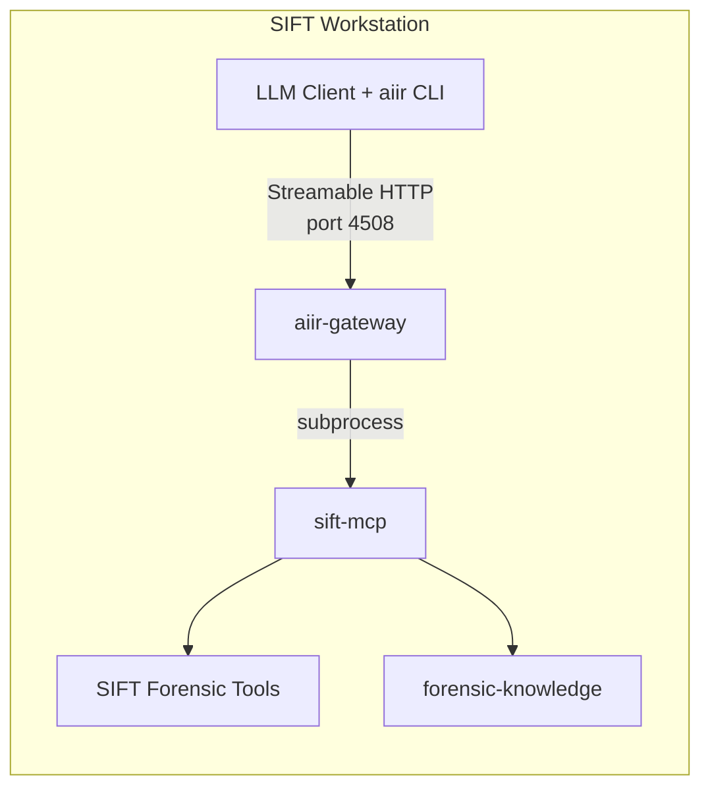

# SIFT MCP

Catalog-gated forensic tool execution with knowledge-enriched response envelopes for the SIFT workstation. Part of the [AIIR](https://github.com/AppliedIR/aiir) platform.

## Architecture

sift-mcp runs as a subprocess of [aiir-gateway](https://github.com/AppliedIR/aiir-gateway). The LLM client and aiir CLI both run on the SIFT workstation. The LLM client connects to the gateway over Streamable HTTP -- it never talks to sift-mcp directly.



### Execution Pipeline

Every tool call follows the same pipeline: catalog check, safe execution, output parsing, knowledge enrichment, audit logging.


## MCP Tools

35 tools across discovery, generic execution, and tool-specific wrappers.

### Discovery

| Tool | Description |
|------|-------------|
| `list_available_tools` | List all cataloged tools with installation status |
| `get_tool_help` | Usage info, flags, caveats, and FK knowledge for a tool |
| `check_tools` | Check which tools are installed and available |
| `suggest_tools` | Given an artifact type, suggest relevant tools with corroboration guidance |

### Generic Execution

| Tool | Description |
|------|-------------|
| `run_command` | Execute any cataloged tool with argument sanitization |

### Zimmerman Suite (12 wrappers)

| Tool | Artifact | What It Proves |
|------|----------|----------------|
| `run_amcacheparser` | Amcache.hve | File PRESENCE (not execution) |
| `run_pecmd` | Prefetch (.pf) | EXECUTION with timestamps and run count |
| `run_appcompatcacheparser` | ShimCache (SYSTEM hive) | File PRESENCE (not execution on Win10+) |
| `run_recmd` | Registry hives | Registry values via batch file extraction |
| `run_mftecmd` | $MFT, $UsnJrnl | File system metadata and change journal |
| `run_evtxecmd` | .evtx files | Windows Event Log entries |
| `run_jlecmd` | Jump Lists | User file access per application |
| `run_lecmd` | LNK shortcuts | File access evidence with timestamps |
| `run_sbecmd` | ShellBags | Folder access evidence |
| `run_rbcmd` | Recycle Bin $I files | Deleted file evidence |
| `run_srumecmd` | SRUM database | Application execution and network usage |
| `run_sqlecmd` | SQLite databases | Browser history and other SQLite stores |

### Sleuth Kit (4 wrappers)

| Tool | Description |
|------|-------------|
| `run_fls` | List files and directories in a disk image |
| `run_icat` | Extract a file by inode number from a disk image |
| `run_blkls` | Extract unallocated clusters for carving |
| `run_mmls` | Display partition table layout |

### File Analysis (3 wrappers)

| Tool | Description |
|------|-------------|
| `run_exiftool` | Extract metadata from files |
| `extract_archive` | Extract or list archives (7z, zip, gz, tar, rar) |
| `run_bulk_extractor` | Carve forensic records from disk images |

### Timeline (2 wrappers)

| Tool | Description |
|------|-------------|
| `run_hayabusa` | Sigma-based Windows event log analyzer |
| `run_mactime` | Convert bodyfile to timeline |

### Other Wrappers

| Tool | Category | Description |
|------|----------|-------------|
| `run_volatility` | Memory | Run Volatility 3 plugins against a memory image |
| `run_yara` | Malware | Run YARA rules against files or directories |
| `run_strings` | Malware | Extract strings (ASCII, UTF-16LE, UTF-16BE) |
| `run_tshark` | Network | Analyze PCAP with display filters and field extraction |
| `run_zeek` | Network | Analyze PCAP and generate protocol logs |
| `run_regripper` | Registry | Run RegRipper against a registry hive |
| `run_hashdeep` | Hashing | Hash files with MD5, SHA-1, SHA-256 |
| `run_dc3dd` | Imaging | Create forensic disk image with inline hashing |
| `run_ewfacquire` | Imaging | Create E01 forensic image |

## What Can You Ask?

```
"Parse the Amcache hive at /cases/evidence/Amcache.hve"

"Run Prefetch analysis on all .pf files in /cases/evidence/prefetch/"

"What tools should I use to investigate lateral movement artifacts?"

"Analyze this memory dump with Volatility -- list processes and network connections"

"Run hayabusa against the evtx logs and show critical/high alerts"

"Extract the $MFT and build a filesystem timeline"

"Check which forensic tools are installed on this workstation"
```

## Response Envelope

Every tool response is wrapped in a structured envelope enriched by [forensic-knowledge](https://github.com/AppliedIR/forensic-knowledge). This ensures the LLM always receives artifact caveats, corroboration suggestions, and discipline reminders alongside tool output.

```json
{
  "success": true,
  "tool": "run_amcacheparser",
  "data": {"AmcacheParser_Output": {"rows": ["..."], "total_rows": 42}},
  "evidence_id": "sift-steve-20260220-001",
  "examiner": "steve",
  "caveats": [
    "Amcache entries indicate file presence, not execution"
  ],
  "advisories": [
    "This artifact does NOT prove: Program was executed by the user",
    "Amcache proves installation -- Prefetch is needed to confirm execution"
  ],
  "corroboration": {
    "for_execution": ["Prefetch", "UserAssist"],
    "for_timeline": ["$MFT timestamps", "USN Journal"]
  },
  "discipline_reminder": "Evidence is sovereign -- if results conflict with your hypothesis, revise the hypothesis, never reinterpret evidence to fit"
}
```

| Field | Description |
|-------|-------------|
| `evidence_id` | Unique ID for referencing in findings (`sift-{examiner}-YYYYMMDD-NNN`) |
| `caveats` | Tool-specific limitations from FK |
| `advisories` | What the artifact does NOT prove, common misinterpretations |
| `corroboration` | Suggested cross-references grouped by purpose |
| `field_notes` | Timestamp field meanings and interpretation guidance |
| `discipline_reminder` | Rotating forensic methodology reminder |

## Tool Catalog

The catalog is the security boundary. Only binaries listed in YAML catalog files can execute. All execution uses `subprocess.run(shell=False)` -- no shell, no arbitrary commands.

| File | Tools |
|------|-------|
| `zimmerman.yaml` | AmcacheParser, PECmd, AppCompatCacheParser, RECmd, MFTECmd, EvtxECmd, JLECmd, LECmd, SBECmd, RBCmd, SrumECmd, SQLECmd, bstrings |
| `volatility.yaml` | vol3 |
| `timeline.yaml` | hayabusa, log2timeline, mactime, psort |
| `sleuthkit.yaml` | fls, icat, mmls, blkls |
| `malware.yaml` | yara, strings |
| `network.yaml` | tshark, zeek |
| `file_analysis.yaml` | bulk_extractor |
| `misc.yaml` | exiftool, regripper, hashdeep, 7z, dc3dd, ewfacquire, ewfmount, vshadowinfo, vshadowmount |

## Prerequisites

- SIFT Workstation (Ubuntu-based)
- Python 3.10+
- Forensic tools installed via SIFT package or manually

## Quick Start

```bash
git clone https://github.com/AppliedIR/aiir.git && cd aiir
./scripts/setup-sift.sh
```

The installer handles sift-mcp, the gateway, and all other SIFT components. Configure your LLM client to connect to the gateway:

```bash
aiir setup client
```

Or add manually:

```json
{
  "mcpServers": {
    "aiir": {
      "type": "streamable-http",
      "url": "http://localhost:4508/mcp"
    }
  }
}
```

## Configuration

| Variable | Default | Description |
|----------|---------|-------------|
| `SIFT_TIMEOUT` | `600` | Default command timeout in seconds |
| `SIFT_TOOL_PATHS` | (none) | Extra binary search paths (colon-separated) |
| `SIFT_HAYABUSA_DIR` | `/opt/hayabusa` | Hayabusa install location |
| `AIIR_CASE_DIR` | (none) | Active case directory -- enables audit trail |
| `AIIR_EXAMINER` | (none) | Examiner identity for evidence IDs and audit |

## Responsible Use

This project is intended for authorized security testing, incident response, and educational purposes. Users are responsible for ensuring their use complies with applicable laws, regulations, and organizational policies. Do not use these tools against systems or data you are not authorized to access.

## Acknowledgments

Architecture and direction by Steve Anson. Implementation by Claude Code (Anthropic).

## License

MIT License - see [LICENSE](LICENSE)
